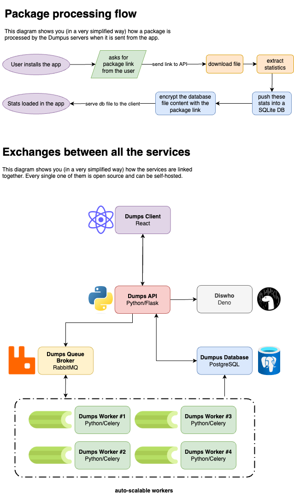

# Self-hosting

You can self-host **everything** in the project, for free. You can build the app for all the environments (mobile, web, desktop...), host your own instance of the API, the database, to keep **complete control on your data**.

## Self-host the app (front)

##  Android

### Requirements

- Android SDK (>= 32).
- Node.js (>= 19).
- Android keystore to sign the APK (optional)

### Instructions

- Clone the repository.
- Run `pnpm install` to install the dependencies.
- Run `pnpm run build:mobile` to build the app for a mobile environment.
- Run `pnpm run script:build-android` to build the app for Android.
- Install the APK located at `./android/app/build/outputs/apk/release/app-release-unsigned.apk` on your device.

##  iOS

N/A.

##  Web

### Requirements

- Node.js (>= 19).

### Instructions

- Clone the repository.
- Run `pnpm install` to install the dependencies.
- Run `pnpm run build:web` to build the app for a web environment.
- Run `pnpm run start` to serve the app.

## Self-host the API (back)

(coming soon)
