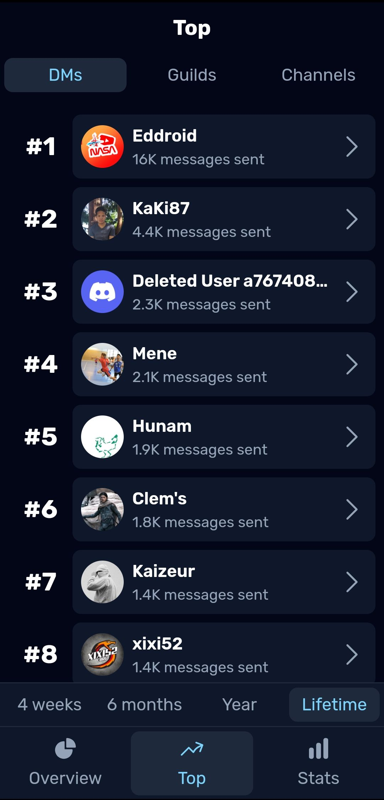

# [👨‍💻 Dumpus (Stats for Discord)](https://play.google.com/store/apps/details?id=app.dumpus.app)

Dumpus is a cross-platform app that gives you advanced statistics on your Discord account. The application analyzes your "Discord Data Package", which you can request in the Discord application settings.

You can join [our Discord server](https://androz2091.fr/discord) to keep up to date and give us your feedback.

## Download

or use the [web version](https://web.dumpus.app), or [Windows, macOS, Linux builds](https://github.com/dumpus-app/dumpus-app/releases/latest).

## Screenshots

|                                                       |                                                       |                                                       |
| ----------------------------------------------------- | ----------------------------------------------------- | ----------------------------------------------------- |
|  |  |  |

## Made with

<code></code> **React** (front-end)  
<code></code> **Python** (back-end)  
<code></code> **PostgreSQL** (database)  
<code></code> **Capacitor** (cross-platform support)

## What's new?

This app is the v2 of the existing [Discord Data Package Explorer](https://ddpe.androz2091.fr), a.k.a **DDPE**. You can see the improvements below:

| Feature                                   | Dumpus        | DDPE                                      |
| ----------------------------------------- | ------------- | ----------------------------------------- |
| **100% open source**                      | ✅            | ✅                                        |
| **Cross-platform**                        | ✅            | ❌ (web only)                             |
| **Server-side processing**                | ✅            | ❌ (only work on really powerful devices) |
| **Advanced statistics**                   | ✅            | ❌ (only basic analysis)                  |
| **Top DMs/servers/channels**              | ✅ (up to 20) | ❌ (10 max)                               |
| **Shareable stats card**                  | ✅            | ❌                                        |
| **Multi-packages handling**               | ✅            | ❌                                        |

Users that self-host the project can access unlimited top (instead of 20) for free. When using our hosted API, users can buy the `Supporter` version to get the access.

## Self-hosting

You can self-host **everything** in the project, for free. You can build the app for all the environments (mobile, web, desktop...), host your own instance of the API and the database, to keep **complete control on your data**.
 
 
[Here](./DEVELOPERS.md) is a guide to self-host the app.

## Need help?

If you need help, you can join the [Discord server](https://androz2091.fr/discord) or open an issue.
