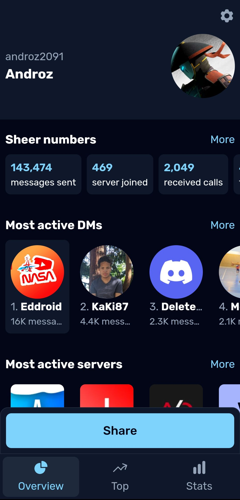
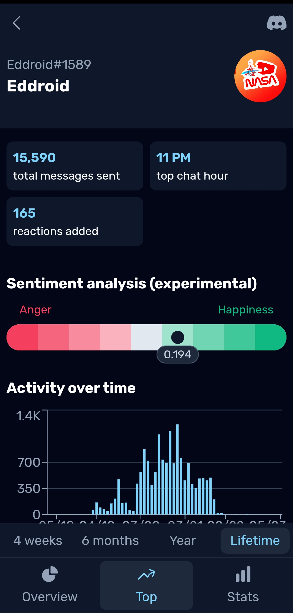

# [👨‍💻 Dumpus (Stats for Discord)](https://play.google.com/store/apps/details?id=app.dumpus.app)

Dumpus is a cross-platform app that gives you advanced statistics on your Discord account. The application analyzes your "Discord Data Package", which you can request in the Discord application settings.

## Download

## What's new?

This app is the v2 of the existing [Discord Data Package Explorer](https://ddpe.androz2091.fr). You can see the improvements below:

| Feature | Dumpus (Free version) | Dumpus (Supporter version) | DDPE |
| --- | --- | --- | --- |
| **Free** | ✅ | 🟠 (€1.29, free if self-hosted) | ✅ |
| **100% open source** | ✅ | ✅ | ✅ |
| **Easy to understand (user-friendly)** | ✅ | ✅ | 🟠 (quite confusing interface) |
| **Cross-platform** | ✅ | ✅ | ❌ (web only) |
| **Server-side processing** | ✅ | ✅ | ❌ (only work on really powerful devices) |
| **Advanced statistics** | ✅ | ✅ | ❌ (only basic analysis) |
| **Top DMs/servers/channels** | Up to 20 | Unlimited | Up to 10 |
| **Help funding this open source project** | 🟠 | ✅ | 🟠 |

## Screenshots

| | | |
| --- | --- | --- |
|  |  |  |

## Made with

<code></code> **React** (front-end)  
<code></code> **Python** (back-end)  
<code></code> **PostgreSQL** (database)  
<code></code> **Capacitor** (cross-platform support)  

## Self-hosting

You can self-host **everything** in the project, for free. You can build the app for all the environments (mobile, web, desktop...), host your own instance of the API, the database, to keep **complete control on your data**.
[Here is a guide to self-host the app](./.github/SELF_HOSTING.md).

## Need help?

If you need help, you can join the [Discord server](https://androz2091.fr/discord) or open an issue.
